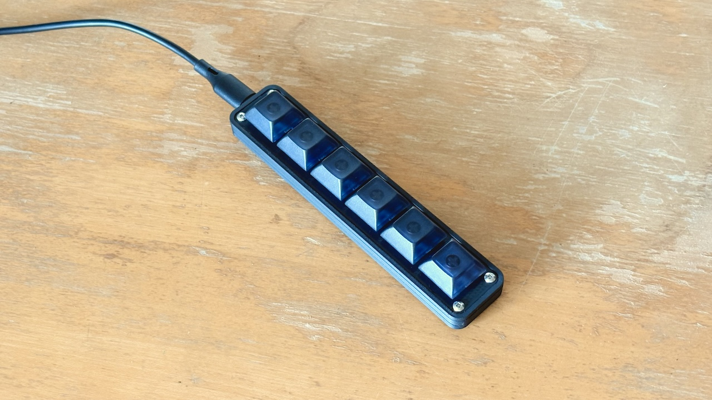
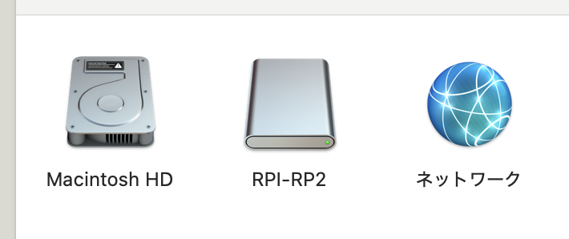
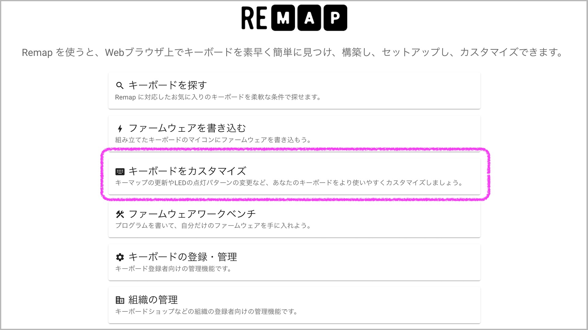
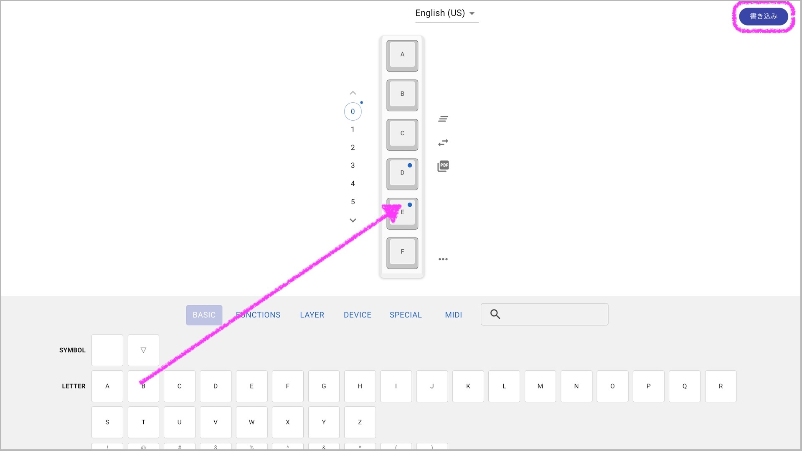
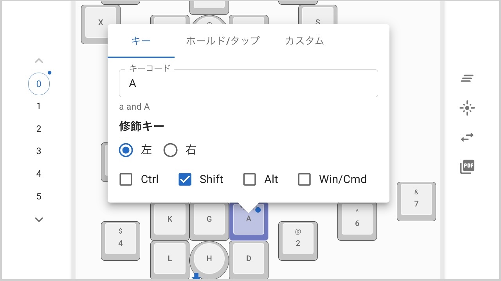
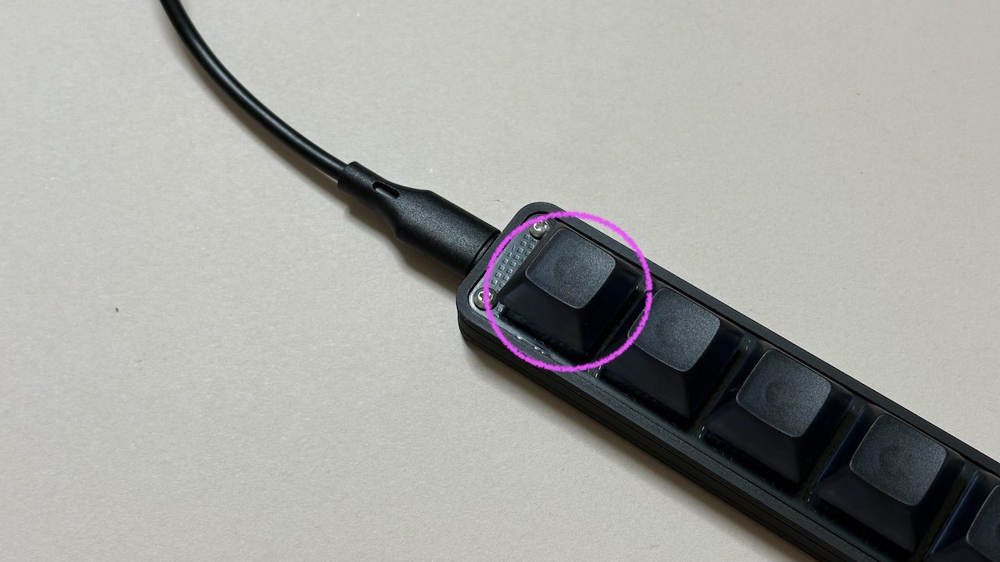
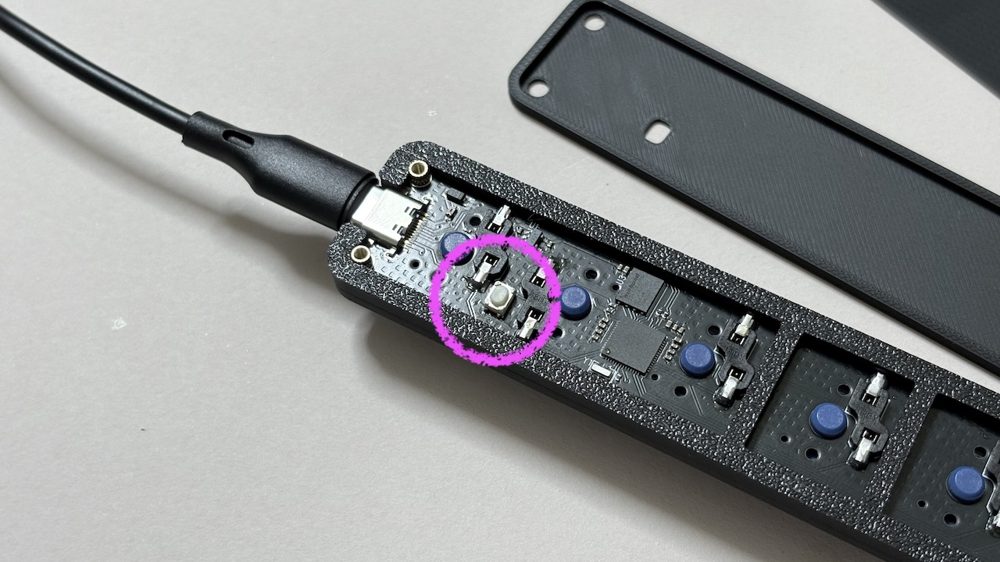

# Short cut con（[日本語](https://note.com/taro_hayashi/n/nccb57a49e0dd)）

## Contents
- Short cut con ...1

## Required
- Type-C USB Cable
- Windows/Mac/Linux (Can be used on iPad or Android but not configured)

## Usage
Recognized as an RPI-RP2 drive when connected to a PC.

Please download this file and drag and drop it there.

- [tarohayashi_wheel_con_via.uf2](https://github.com/Taro-Hayashi/wheelcon/releases/latest/download/tarohayashi_wheel_con_via.uf2)

When the RPI-RP2 drive automatically disappears, you are done.

## Customize

Connect to Remap and select Customise.

- remap https://remap-keys.app/

Continue on and select Cannonball LL.

Drag and drop from the key list below and press the write button in the top right corner to swap keys.

You can also set simultaneous presses with modifier keys by clicking on the key.

## How to update firmware
Press and hold the top wheel and connect your PC, The RPI-RP2 drive appears. Drag and drop the new firmware there.

## How to reset to factory defaults
Unscrew and disassemble it, then connect it to the PC while pressing the button on the back side, The RPI-RP2 drive appears.

Download flash_nuke.uf2 from the bottom item on this page and drag and drop it there.
- https://www.raspberrypi.com/documentation/microcontrollers/raspberry-pi-pico.html

Once the drive disappears and reappears, the reset is complete.

## Sorce
- qmk_firmware

https://github.com/Taro-Hayashi/qmk_firmware/tree/tarohayashi/keyboards/tarohayashi/short_cut_con

## Thanks
This keyboard was commissioned and produced based on an idea by figure prototype maker CKB.

- https://twitter.com/miku1596

## Sales
- BOOTH https://tarohayashi.booth.pm/items/6922908
